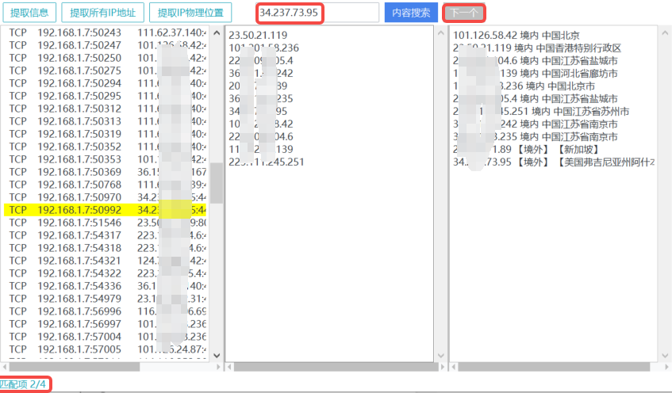
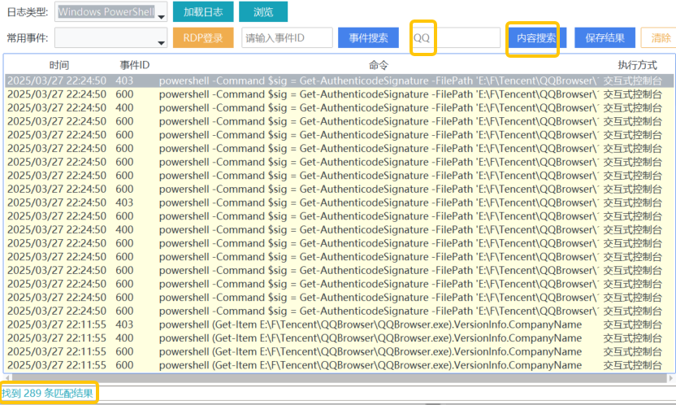
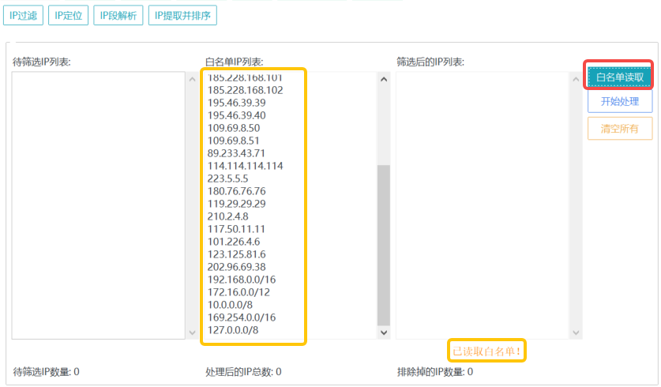

# DD安全助手

# 1. ✨简介
    DD安全助手是一款集成多种安全功能的工具箱，支持网络排查、主机信息收集、安全日志查询、IP类处理、文件内容搜索等相关操作

# 2. 💡功能说明


1.网络排查模块:
* 提取信息：从一键提取或主动输入的netstat -ano中提取网络连接信息。
* 提取所有IP地址：提取所有 IP 地址。
* 提取IP物理位置：查询IP地址的物理位置信息。
* 内容搜索：查询指定的IP/PID/port等信息。


2.主机监控模块:【非管理员权限只可读取部分信息】
* 用户信息：查看系统用户列表，识别常见的异常用户。
* 计划任务：检索系统计划任务，检测其中应用程序的数字签名状态。
* 服务信息：查看系统服务详情，检测其中应用程序的数字签名状态。
* 启动项：查看启动项，检测其中应用程序的数字签名状态。
* 进程信息：查看当前进程列表，检测其中应用程序的数字签名状态。
* 重复进程检测：查看上述中重复存在的应用程序。
* 内容搜索：上述5个模块数据收集完成后，可以查询指定内容。

3.日志分析模块:【需要管理员权限】
* 安全日志：分析登录成功/失败以及其他登录事件。
* Windows PowerShell 日志：检测异常 PowerShell 命令。
* 自定义文件：加载第三方自定义日志文件(安全日志、PS日志)。
* RDP登录分析：列出多次尝试RDP登录的IP信息。
* SMB登录分析：列出多次尝试SMB登录的IP信息。
* 内容搜索：日志加载完成后，可以查询指定内容。

4.IP类处理模块:
* IP过滤：根据白名单过滤 IP 地址。(HW和日常研判必备，优先过滤公司IP/内网IP/公共DNS等，避免误封！)
* IP定位：查询 IP 地址的地理位置。
* IP段解析：解析 IP 段范围。
* IP提取并排序：从文本中提取并排序 IP 地址。

5.文件内容搜索模块:
* 在指定路径下搜索包含特定内容的文件，并进行时间排序 (忘了文件所在路径没关系，可以用它直接搜索)

6.免杀辅助模块:
* 哈希修改：修改文件哈希，绕过简单检测。
* 签名复制：复制文件签名，提升可信度。
* 图标提取：提取文件图标，绕过简单识别。
* 图片转 ICO：将图片转换为 ICO格式。

# 3. ✅WB云沙箱检测截图

```MD5：e5a9f6671bcd69f3669a26c168078ac1```


# 4. 📌功能详情
## ⌨网络排查:
通过点击**提取信息**或主动输入netstat -ano中提取的网络连接信息，可以从中筛选出外连IP，并针对外连IP可以定位物理地址并进行**境内/境外**的区分，并标记**境外**IP。


通过**内容搜索**可以查询指定的内容，如外连IP的PID，或PID对应的外连IP等。点击**下一个**可以查看多项匹配内容，并进行标记。




## 🖥主机信息:

**`现在正在加载中~`就不要点击工具的界面了，等待加载完成后会显示`已加载XXX`这时候可以查看收集的数据，也可以搜索指定的内容了**
* **用户信息查看:** 可以查看系统中的用户、隐藏用户、异常用户等


* **计划任务查看:**


* **启动项信息查看:**


* **服务信息查看:**


* **进程信息查看:**


* **重复程序查看:**


## 📋日志分析:

    日志类型里选择的安全日志与PowerShell日志是本机系统的，浏览里选择的安全日志和PowerShell日志是加载第三方的，如服务器的

**`点击加载日志后，请等待日志加载完成，加载过程中不要点击GUI界面！！`**

* **加载安全日志:** 这里日志类型里的是本地系统的安全日志，选择加载日志后可以在常用事件里选择对应的安全事件，这里主推登录成功/登录失败，其他安全事件里的内容可能解析不全


* **RDP登录分析结果:**
加载本地和第三方安全日志后，可以点击"RDP登录分析"来查看有哪些IP进行了rdp的登录尝试和爆破，以及登录成功


* **SMB登录分析结果:**
加载本地和第三方安全日志后，可以点击"SMB登录分析"来查看有哪些IP进行了smb的登录尝试和爆破，以及登录


* **加载PowerShell日志:**
**`点击加载日志后，请等待日志加载完成，加载过程中不要点击GUI界面！！
`**


PS日志加载完成后，可以右键选择复制指定内容：


* **指定内容搜索:**




* **加载第三方日志:**
点击"浏览"，选择其他路径下的日志内容，通常是从其他终端/服务器中复制过来的安全日志或PowerShell日志，选择日志后，点击"加载日志"，操作同上：


## ⚙IP类处理
* **IP过滤:** 首先在'白名单IP列表'里填入我们的白名单，比如公司IP/公共DNS/内网IP等，点击'白名单读取'，就会在本地会生成白名单文件 `whitelist.txt`；白名单读取成功后就可以在'待筛选IP列表'里输入我们的IP，比如攻击IP，点击'开始处理'后，就可以在'筛选后的IP列表'中看到过滤后的IP地址了。这时候可以查询IP的威胁情报下一步进行上报或者封禁。




* **IP定位**：查询 IP 地址的地理位置。


* **IP段解析**：解析 IP 段范围。


* **IP提取并排序**：从文本中提取IP地址并进行排序。


## 🧲文件内容搜索:
    在指定路径下搜索包含特定内容的文件，并进行时间排序，在文件路径下选择一条路径右键可以选择`打开所在目录`


## 🎯免杀辅助:
* **哈希修改：** 修改文件哈希，绕过简单检测。


* **签名复制：** 复制文件签名，提升可信度。


* **杀软识别：**


* **图标提取：** 提取exe文件图标，绕过简单识别。


* **图片转ICO：** 将图片转换为 ICO格式。


# 4. 免责声明

`该工具仅供安全研究与学习之用，如用于其他用途，由使用者承担全部法律及连带责任，作者不承担任何法律责任。`

# 👍大佬项目 
* https://github.com/secretsquirrel/SigThief
* https://github.com/mir1ce/Hawkeye
